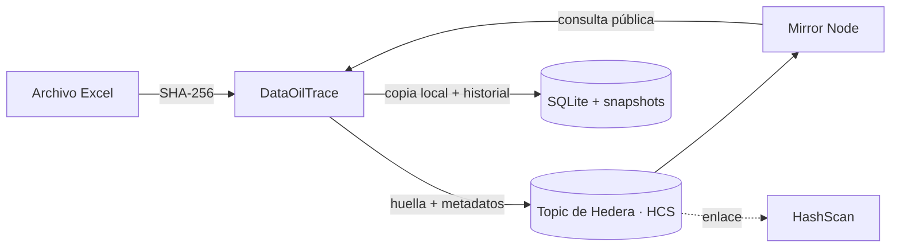

# DataOilTrace

**Evidencia verificable de integridad para archivos de la industria de petróleo y gas, sellada en Hedera.**

DataOilTrace calcula la huella digital (SHA-256) de un archivo, la registra en **Hedera Consensus Service** junto con metadatos de versión, y permite comprobar en cualquier momento, e incluso por un tercero, si el archivo sigue siendo idéntico al que se selló o fue alterado.

> Proyecto desarrollado para el hackathon **Descifra Hedera (UFest26 · UIS)**.

<!-- Agrega aquí tus capturas: crea la carpeta docs/ y descomenta las líneas


-->

## El problema

En el sector de hidrocarburos circulan archivos de alto valor y alto riesgo: producción fiscalizada de crudo y gas, informes técnicos, información geoespacial. Cuando un archivo cambia después de haber sido reportado, hoy es difícil demostrar **qué cambió, cuándo y quién lo puede comprobar** sin confiar en un único sistema o administrador.

Esto importa especialmente en regiones como Santander y el Magdalena Medio, donde la actividad petrolera es central y la trazabilidad de la información de producción tiene consecuencias fiscales y regulatorias.

## La solución

DataOilTrace no guarda el archivo en la red: guarda **una prueba criptográfica** de su contenido.

1. Se calcula el SHA-256 del archivo.
2. La huella y los metadatos de la versión se publican en un **Topic de Hedera (HCS)**. Hedera asigna un *consensus timestamp* que nadie puede modificar.
3. Cada nueva versión referencia a la anterior (`parent_hash`), formando una cadena de auditoría.
4. Para verificar, se recalcula la huella del archivo y se compara con el registro público consultando el **Mirror Node**.



## Uso de Hedera

| Componente | Para qué se usa |
|---|---|
| **Hedera Consensus Service (HCS)** | Registrar de forma inmutable y con marca de tiempo la huella y los metadatos de cada versión. |
| **Topic con `submit_key`** | Solo la cuenta operadora puede escribir en el topic, así nadie más puede falsificar registros. |
| **Mirror Node (REST)** | Verificar cada registro y buscar una huella en el topic sin depender de la base de datos local. |
| **HashScan** | Enlaces directos a cada transacción para auditoría visual. |

Cada mensaje registrado en el topic tiene este formato (el límite de HCS es 1024 bytes):

```json
{
  "app": "DataOilTrace",
  "file_name": "Producción_Fiscalizada_Crudo_2015.xlsx",
  "hash_sha256": "3cacdd40a6c1…",
  "metadata": {
    "version": 1,
    "parent_hash": null,
    "file_size": 89791,
    "file_type": ".xlsx",
    "change_summary": "Versión inicial: no existe una versión anterior."
  }
}
```

**Topic de demostración (testnet):** [`0.0.10810981`](https://hashscan.io/testnet/topic/0.0.10810981)

## Funcionalidades

- **Panel de integridad:** indicadores de archivos, versiones, íntegros, modificados y sin verificar.
- **Sellado de versiones:** registro de la huella en Hedera con enlace a HashScan.
- **Detección de cambios:** al modificar un archivo, la app lo marca como modificado y muestra celda por celda qué cambió (`antes → después`).
- **Historial de versiones** con copias locales para comparar cualquier par de versiones.
- **Auditoría:** línea de tiempo con los *consensus timestamps* tomados de Hedera.
- **Verificación pública:** cualquier persona puede subir un archivo y comprobar si fue sellado, **sin necesitar el historial de la aplicación**.

## Instalación

Requisitos: **Python 3.10 o superior** y una cuenta de **Hedera Testnet** (gratuita en [portal.hedera.com](https://portal.hedera.com)).

```bash
git clone https://github.com/<tu-usuario>/<tu-repositorio>.git
cd <tu-repositorio>

python -m venv .venv
# Windows (PowerShell)
.venv\Scripts\activate
# macOS / Linux
source .venv/bin/activate

pip install -r requirements.txt
```

### Configuración

Copia la plantilla y completa tus credenciales de testnet:

```bash
# Windows (PowerShell)
copy .env.example .env
# macOS / Linux
cp .env.example .env
```

```ini
HEDERA_NETWORK=testnet
HEDERA_OPERATOR_ID=0.0.xxxxxxx
HEDERA_OPERATOR_KEY=<tu clave privada de testnet>
HEDERA_TOPIC_ID=
```

> ⚠️ **Nunca subas el archivo `.env` al repositorio.** Ya está excluido en `.gitignore`.

### Crear el topic

```bash
python crear_topic.py
```

El script crea un Topic en testnet y guarda su ID en `.env` automáticamente.

### Ejecutar la aplicación

```bash
python main.py
```

### Ejecutar las pruebas

```bash
python -m unittest discover -s tests
```

## Cómo probarla (recorrido sugerido)

1. En **Archivo**, selecciona un libro de Excel y pulsa **Registrar versión inicial**.
2. Comprueba que el veredicto cambia a **ARCHIVO ÍNTEGRO** y abre la transacción en HashScan.
3. Modifica una celda del Excel y pulsa **Recalcular**: aparece **ARCHIVO MODIFICADO** con el detalle del cambio.
4. Pulsa **Registrar como v2** para sellar la nueva versión.
5. En **Auditoría**, revisa la línea de tiempo con los timestamps de consenso.
6. En **Verificar**, sube cualquier archivo para comprobar si fue sellado, con o sin el historial local.

## Estructura del proyecto

```
├── main.py                  # Punto de entrada
├── crear_topic.py           # Crea el Topic en Hedera Testnet
├── config/settings.py       # Variables de entorno y URLs de Hedera
├── services/
│   ├── hasher.py            # SHA-256 (por bloques) de archivos
│   ├── hedera_service.py    # Envío de mensajes a HCS
│   ├── verifier.py          # Verificación contra Mirror Node
│   └── excel_diff.py        # Comparación celda a celda de libros Excel
├── storage/version_store.py # Historial de versiones (SQLite + snapshots)
├── ui/                      # Interfaz en Flet (panel, archivo, auditoría, verificar)
└── tests/                   # Pruebas del historial y de la interfaz
```

## Privacidad y seguridad

- **El archivo nunca sale de tu equipo ni se publica en Hedera.** En la red solo queda la huella, el nombre del archivo y los metadatos de versión.
- Hedera da evidencia de *qué contenido existía y cuándo*; no vuelve inmutable el archivo original.
- El topic usa `submit_key`: solo la cuenta operadora puede registrar mensajes.
- La creación del topic está bloqueada fuera de testnet.

## Limitaciones actuales y hoja de ruta

- **Hoy:** soporta libros de Excel (`.xlsx`, `.xlsm`), con el caso de uso de *producción fiscalizada de crudo*.
- **Próximos pasos:**
  - Sellar otros formatos: PDF (informes técnicos) y **shapefiles** (paquete `.shp`, `.shx`, `.dbf`, `.prj` con un hash único del conjunto).
  - Soportar producción de gas y otros tipos de documento con campos de campo, operador y periodo.
  - Búsqueda en topics de gran volumen (la verificación pública revisa hasta 2000 mensajes por consulta).
  - Control de acceso por roles y paso a mainnet.

## Uso de herramientas de IA

<!-- Los lineamientos del hackathon piden declarar las herramientas de IA utilizadas. Completa y ajusta. -->
Este proyecto se desarrolló con apoyo de **Claude (Anthropic)** para revisión de código, integración con el SDK de Hedera y diseño de la interfaz. La arquitectura, las decisiones de diseño y las pruebas fueron revisadas y ejecutadas por el autor.

## Equipo

<!-- Completa con los nombres del equipo -->
- **[Nombre del equipo]**: [integrantes]

## Enlaces

- 🎥 Video de demostración: _[pega aquí el enlace]_
- 🔍 Topic en HashScan: https://hashscan.io/testnet/topic/0.0.10810981

## Licencia

<!-- Elige una (por ejemplo MIT) y agrega un archivo LICENSE; GitHub puede crearlo desde "Add file → Create new file → LICENSE". -->
_Por definir._
